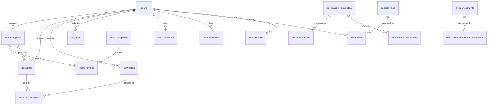

# Database Schema

This document provides complete technical specifications for all 24 database tables in the Sabiquun application, including CREATE TABLE statements, indexes, default records, and relationships.

## Table of Contents

- [Overview](#overview)
- [Core Tables](#core-tables)
  - [Users](#1-users)
  - [Deed Templates](#2-deed_templates)
  - [Deeds Reports](#3-deeds_reports)
  - [Deed Entries](#4-deed_entries)
- [Financial Tables](#financial-tables)
  - [Penalties](#5-penalties)
  - [Payments](#6-payments)
  - [Penalty Payments](#7-penalty_payments)
- [Excuse System](#excuse-system)
  - [Excuses](#8-excuses)
  - [Rest Days](#9-rest_days)
- [Configuration Tables](#configuration-tables)
  - [Settings](#10-settings)
  - [Notification Templates](#11-notification_templates)
  - [Notification Schedules](#12-notification_schedules)
- [Activity & Tracking](#activity--tracking)
  - [Notifications Log](#13-notifications_log)
  - [Audit Logs](#14-audit_logs)
  - [User Sessions](#16-user_sessions)
- [Statistics & Leaderboard](#statistics--leaderboard)
  - [User Statistics](#17-user_statistics)
  - [Leaderboard](#18-leaderboard)
  - [Special Tags](#20-special_tags)
  - [User Tags](#21-user_tags)
- [Content Management](#content-management)
  - [App Content](#22-app_content)
  - [Announcements](#23-announcements)
  - [User Announcement Dismissals](#24-user_announcement_dismissals)
- [Supporting Tables](#supporting-tables)
  - [Password Reset Tokens](#15-password_reset_tokens)
  - [Payment Methods](#19-payment_methods)

## Overview

The Sabiquun database consists of 24 interconnected tables supporting a complete Islamic deed tracking application with penalties, payments, notifications, and gamification features.

### Entity Relationship Overview



---

## Core Tables

### 1. users

Stores all user accounts with authentication, role, and membership information.

```sql
CREATE TABLE users (
  id UUID PRIMARY KEY DEFAULT uuid_generate_v4(),
  email VARCHAR(255) UNIQUE NOT NULL,
  password_hash VARCHAR(255) NOT NULL,
  name VARCHAR(255) NOT NULL,
  phone VARCHAR(50),
  photo_url TEXT,
  role VARCHAR(50) NOT NULL DEFAULT 'user',
    -- Values: 'user', 'supervisor', 'cashier', 'admin'
  membership_status VARCHAR(50) NOT NULL DEFAULT 'new',
    -- Values: 'new', 'exclusive', 'legacy'
  account_status VARCHAR(50) NOT NULL DEFAULT 'pending',
    -- Values: 'pending', 'active', 'suspended', 'auto_deactivated'
  excuse_mode BOOLEAN DEFAULT FALSE,
  created_at TIMESTAMP DEFAULT CURRENT_TIMESTAMP,
  approved_by UUID REFERENCES users(id),
  approved_at TIMESTAMP,
  updated_at TIMESTAMP DEFAULT CURRENT_TIMESTAMP
);

CREATE INDEX idx_users_email ON users(email);
CREATE INDEX idx_users_role ON users(role);
CREATE INDEX idx_users_account_status ON users(account_status);
```

**Membership Status Levels:**
- `new`: First 30 days (training period, no penalties)
- `exclusive`: Days 31 to 1095 (3 years)
- `legacy`: After 3 years

**Account Status Values:**
- `pending`: Awaiting admin approval
- `active`: Normal active account
- `suspended`: Manually suspended by admin
- `auto_deactivated`: Automatically deactivated due to high penalty balance

---

### 2. deed_templates

Defines the template for all trackable Islamic deeds in the system.

```sql
CREATE TABLE deed_templates (
  id UUID PRIMARY KEY DEFAULT uuid_generate_v4(),
  deed_name VARCHAR(255) NOT NULL,
  deed_key VARCHAR(100) UNIQUE NOT NULL,
    -- e.g., 'fajr_prayer', 'duha_prayer'
  category VARCHAR(50) NOT NULL,
    -- Values: 'sunnah', 'faraid'
  value_type VARCHAR(50) NOT NULL,
    -- Values: 'binary', 'fractional'
  sort_order INTEGER NOT NULL,
  is_active BOOLEAN DEFAULT TRUE,
  is_system_default BOOLEAN DEFAULT FALSE,
    -- True for original 10 deeds, cannot be deleted
  created_at TIMESTAMP DEFAULT CURRENT_TIMESTAMP,
  updated_at TIMESTAMP DEFAULT CURRENT_TIMESTAMP
);

CREATE INDEX idx_deed_templates_active ON deed_templates(is_active);
CREATE INDEX idx_deed_templates_sort_order ON deed_templates(sort_order);
```

**Default Records (inserted on system setup):**

```sql
INSERT INTO deed_templates (deed_name, deed_key, category, value_type, sort_order, is_system_default) VALUES
('Fajr Prayer', 'fajr_prayer', 'faraid', 'binary', 1, TRUE),
('Duha Prayer', 'duha_prayer', 'sunnah', 'binary', 2, TRUE),
('Dhuhr Prayer', 'dhuhr_prayer', 'faraid', 'binary', 3, TRUE),
('Juz of Quran', 'juz_quran', 'sunnah', 'binary', 4, TRUE),
('Asr Prayer', 'asr_prayer', 'faraid', 'binary', 5, TRUE),
('Sunnah Prayers', 'sunnah_prayers', 'sunnah', 'fractional', 6, TRUE),
('Maghrib Prayer', 'maghrib_prayer', 'faraid', 'binary', 7, TRUE),
('Isha Prayer', 'isha_prayer', 'faraid', 'binary', 8, TRUE),
('Athkar', 'athkar', 'sunnah', 'binary', 9, TRUE),
('Witr', 'witr', 'sunnah', 'binary', 10, TRUE);
```

**Value Types:**
- `binary`: 0 or 1 (done/not done)
- `fractional`: 0.0 to 1.0 in 0.1 increments (e.g., partial completion of sunnah prayers)

---

### 3. deeds_reports

Daily reports submitted by users tracking their deeds.

```sql
CREATE TABLE deeds_reports (
  id UUID PRIMARY KEY DEFAULT uuid_generate_v4(),
  user_id UUID NOT NULL REFERENCES users(id) ON DELETE CASCADE,
  report_date DATE NOT NULL,
  total_deeds DECIMAL(4,1) NOT NULL DEFAULT 0,
    -- Calculated sum, e.g., 9.5
  sunnah_count DECIMAL(4,1) NOT NULL DEFAULT 0,
    -- Calculated from deed entries
  faraid_count DECIMAL(4,1) NOT NULL DEFAULT 0,
    -- Calculated from deed entries
  status VARCHAR(50) NOT NULL DEFAULT 'draft',
    -- Values: 'draft', 'submitted'
  submitted_at TIMESTAMP,
  created_at TIMESTAMP DEFAULT CURRENT_TIMESTAMP,
  updated_at TIMESTAMP DEFAULT CURRENT_TIMESTAMP,
  UNIQUE(user_id, report_date)
);

CREATE INDEX idx_deeds_reports_user_date ON deeds_reports(user_id, report_date);
CREATE INDEX idx_deeds_reports_date ON deeds_reports(report_date);
CREATE INDEX idx_deeds_reports_status ON deeds_reports(status);
```

**Business Rules:**
- One report per user per day
- Reports remain as 'draft' until submitted
- Draft reports expire after grace period (12 PM next day)
- Total deeds auto-calculated from deed_entries

---

### 4. deed_entries

Individual deed values within a daily report.

```sql
CREATE TABLE deed_entries (
  id UUID PRIMARY KEY DEFAULT uuid_generate_v4(),
  report_id UUID NOT NULL REFERENCES deeds_reports(id) ON DELETE CASCADE,
  deed_template_id UUID NOT NULL REFERENCES deed_templates(id),
  deed_value DECIMAL(3,1) NOT NULL DEFAULT 0,
    -- 0, 1, or 0.1-1.0 for fractional
  created_at TIMESTAMP DEFAULT CURRENT_TIMESTAMP,
  UNIQUE(report_id, deed_template_id)
);

CREATE INDEX idx_deed_entries_report ON deed_entries(report_id);
CREATE INDEX idx_deed_entries_template ON deed_entries(deed_template_id);
```

**Value Rules:**
- Binary deeds: 0 or 1
- Fractional deeds: 0.0, 0.1, 0.2, ... 1.0
- One entry per deed template per report

---

## Financial Tables

### 5. penalties

Tracks all penalties incurred by users for missed deeds.

```sql
CREATE TABLE penalties (
  id UUID PRIMARY KEY DEFAULT uuid_generate_v4(),
  user_id UUID NOT NULL REFERENCES users(id) ON DELETE CASCADE,
  report_id UUID REFERENCES deeds_reports(id),
    -- Nullable for manual penalties
  amount DECIMAL(10,2) NOT NULL,
  date_incurred DATE NOT NULL,
  status VARCHAR(50) NOT NULL DEFAULT 'unpaid',
    -- Values: 'unpaid', 'paid', 'waived'
  paid_amount DECIMAL(10,2) DEFAULT 0,
    -- Tracks partial payments
  waived_by UUID REFERENCES users(id),
    -- Admin/Cashier who waived
  waived_reason TEXT,
  created_at TIMESTAMP DEFAULT CURRENT_TIMESTAMP,
  updated_at TIMESTAMP DEFAULT CURRENT_TIMESTAMP
);

CREATE INDEX idx_penalties_user ON penalties(user_id);
CREATE INDEX idx_penalties_status ON penalties(status);
CREATE INDEX idx_penalties_date ON penalties(date_incurred);
```

**Penalty Calculation:**
- Standard rate: 5000 shillings per full missed deed
- Fractional: 500 shillings per 0.1 deed missed
- Only applied to 'exclusive' and 'legacy' members
- Not applied on rest days or with approved excuses

---

### 6. payments

User payment submissions for penalty settlement.

```sql
CREATE TABLE payments (
  id UUID PRIMARY KEY DEFAULT uuid_generate_v4(),
  user_id UUID NOT NULL REFERENCES users(id) ON DELETE CASCADE,
  amount DECIMAL(10,2) NOT NULL,
  payment_method VARCHAR(100) NOT NULL,
    -- e.g., 'ZAAD', 'eDahab'
  reference_number VARCHAR(255),
    -- Optional user-provided reference
  payment_type VARCHAR(50) NOT NULL,
    -- Values: 'full', 'partial'
  status VARCHAR(50) NOT NULL DEFAULT 'pending',
    -- Values: 'pending', 'approved', 'rejected'
  submitted_at TIMESTAMP DEFAULT CURRENT_TIMESTAMP,
  reviewed_by UUID REFERENCES users(id),
    -- Admin/Cashier who reviewed
  reviewed_at TIMESTAMP,
  rejection_reason TEXT,
  created_at TIMESTAMP DEFAULT CURRENT_TIMESTAMP
);

CREATE INDEX idx_payments_user ON payments(user_id);
CREATE INDEX idx_payments_status ON payments(status);
CREATE INDEX idx_payments_submitted_at ON payments(submitted_at);
```

**Payment Workflow:**
1. User submits payment with proof
2. Admin/Cashier reviews
3. Upon approval, payment applied to penalties via FIFO algorithm
4. User notified of approval/rejection

---

### 7. penalty_payments

Junction table linking payments to penalties (many-to-many).

```sql
CREATE TABLE penalty_payments (
  id UUID PRIMARY KEY DEFAULT uuid_generate_v4(),
  penalty_id UUID NOT NULL REFERENCES penalties(id) ON DELETE CASCADE,
  payment_id UUID NOT NULL REFERENCES payments(id) ON DELETE CASCADE,
  amount_applied DECIMAL(10,2) NOT NULL,
    -- Amount from this payment applied to this penalty
  created_at TIMESTAMP DEFAULT CURRENT_TIMESTAMP
);

CREATE INDEX idx_penalty_payments_penalty ON penalty_payments(penalty_id);
CREATE INDEX idx_penalty_payments_payment ON penalty_payments(payment_id);
```

**Purpose:**
- Tracks how each payment is distributed across penalties
- Enables partial payment tracking
- Supports FIFO payment application

---

## Excuse System

### 8. excuses

User-submitted excuses for missed deeds (sickness, travel, etc.).

```sql
CREATE TABLE excuses (
  id UUID PRIMARY KEY DEFAULT uuid_generate_v4(),
  user_id UUID NOT NULL REFERENCES users(id) ON DELETE CASCADE,
  report_date DATE NOT NULL,
  excuse_type VARCHAR(50) NOT NULL,
    -- Values: 'sickness', 'travel', 'raining'
  description TEXT,
  affected_deeds JSONB NOT NULL,
    -- Array of deed_template_ids or {"all": true}
    -- e.g., ["uuid1", "uuid2"] or {"all": true}
  status VARCHAR(50) NOT NULL DEFAULT 'pending',
    -- Values: 'pending', 'approved', 'rejected'
  submitted_at TIMESTAMP DEFAULT CURRENT_TIMESTAMP,
  reviewed_by UUID REFERENCES users(id),
    -- Supervisor/Admin who reviewed
  reviewed_at TIMESTAMP,
  rejection_reason TEXT,
  created_at TIMESTAMP DEFAULT CURRENT_TIMESTAMP
);

CREATE INDEX idx_excuses_user ON excuses(user_id);
CREATE INDEX idx_excuses_status ON excuses(status);
CREATE INDEX idx_excuses_date ON excuses(report_date);
```

**Excuse Types:**
- `sickness`: Medical condition
- `travel`: Away from home
- `raining`: Weather conditions (affects specific prayers)

**Affected Deeds Format:**

```json
// All deeds
{"all": true}

// Specific deeds
["uuid-of-fajr", "uuid-of-duha"]
```

---

### 9. rest_days

System-wide rest days (no penalties applied).

```sql
CREATE TABLE rest_days (
  id UUID PRIMARY KEY DEFAULT uuid_generate_v4(),
  rest_date DATE NOT NULL UNIQUE,
  description VARCHAR(255),
    -- e.g., "Eid al-Fitr"
  is_recurring BOOLEAN DEFAULT FALSE,
    -- Repeats annually if true
  created_by UUID NOT NULL REFERENCES users(id),
  created_at TIMESTAMP DEFAULT CURRENT_TIMESTAMP,
  updated_at TIMESTAMP DEFAULT CURRENT_TIMESTAMP
);

CREATE INDEX idx_rest_days_date ON rest_days(rest_date);
```

**Usage:**
- Islamic holidays (Eid, etc.)
- Special community events
- No penalties on these dates
- System automatically checks before applying penalties

---

## Configuration Tables

### 10. settings

System-wide configuration key-value pairs.

```sql
CREATE TABLE settings (
  id UUID PRIMARY KEY DEFAULT uuid_generate_v4(),
  setting_key VARCHAR(100) UNIQUE NOT NULL,
  setting_value TEXT NOT NULL,
    -- Stored as string, parsed based on data_type
  description TEXT,
  data_type VARCHAR(50) NOT NULL,
    -- Values: 'string', 'number', 'boolean', 'json'
  updated_by UUID REFERENCES users(id),
  updated_at TIMESTAMP DEFAULT CURRENT_TIMESTAMP
);

CREATE INDEX idx_settings_key ON settings(setting_key);
```

**Default Settings:**

```sql
INSERT INTO settings (setting_key, setting_value, description, data_type) VALUES
('penalty_per_deed', '5000', 'Penalty amount per full deed missed (in shillings)', 'number'),
('grace_period_hours', '12', 'Hours after midnight for grace period', 'number'),
('training_period_days', '30', 'Days of training period for new members (no penalties)', 'number'),
('auto_deactivation_threshold', '500000', 'Penalty balance threshold for auto-deactivation', 'number'),
('warning_thresholds', '[400000, 450000]', 'Balance thresholds for warning notifications', 'json'),
('payment_methods', '["ZAAD", "eDahab"]', 'Available payment methods', 'json'),
('bulk_report_enabled', 'true', 'Enable bulk report submission feature', 'boolean'),
('force_update_enabled', 'false', 'Force app update for users', 'boolean'),
('minimum_app_version', '1.0.0', 'Minimum required app version', 'string'),
('mailgun_api_key', '', 'Mailgun API key for email service', 'string'),
('mailgun_domain', '', 'Mailgun domain', 'string'),
('sender_email', 'noreply@gooddeeds.app', 'Email sender address', 'string'),
('sender_name', 'Good Deeds App', 'Email sender name', 'string'),
('fcm_server_key', '', 'Firebase Cloud Messaging server key', 'string');
```

---

### 11. notification_templates

Reusable notification message templates with placeholders.

```sql
CREATE TABLE notification_templates (
  id UUID PRIMARY KEY DEFAULT uuid_generate_v4(),
  template_key VARCHAR(100) UNIQUE NOT NULL,
    -- e.g., 'deadline_reminder', 'penalty_incurred'
  title VARCHAR(255) NOT NULL,
    -- Supports placeholders: {user_name}, {amount}, etc.
  body TEXT NOT NULL,
    -- Supports placeholders
  notification_type VARCHAR(50) NOT NULL,
    -- e.g., 'deadline', 'payment', 'penalty', 'excuse'
  is_active BOOLEAN DEFAULT TRUE,
  is_system_default BOOLEAN DEFAULT TRUE,
    -- System templates cannot be deleted
  created_at TIMESTAMP DEFAULT CURRENT_TIMESTAMP,
  updated_at TIMESTAMP DEFAULT CURRENT_TIMESTAMP
);

CREATE INDEX idx_notification_templates_key ON notification_templates(template_key);
CREATE INDEX idx_notification_templates_type ON notification_templates(notification_type);
```

**Default Templates (examples):**

```sql
INSERT INTO notification_templates (template_key, title, body, notification_type, is_system_default) VALUES
('deadline_reminder', 'Reminder: Submit Today''s Deeds', 'You have until 12 PM tomorrow to submit today''s report. Current progress: {progress}', 'deadline', TRUE),
('penalty_incurred', 'Penalty Applied', 'Penalty of {amount} shillings applied for {missed_deeds} missed deeds on {date}. Current balance: {balance}', 'penalty', TRUE),
('payment_approved', 'Payment Approved', 'Your payment of {amount} shillings has been approved. New balance: {balance}', 'payment', TRUE),
('grace_period_ending', 'Grace Period Ending Soon', 'You have 1 hour left to submit yesterday''s report. Submit now to avoid penalty.', 'deadline', TRUE),
('account_deactivated', 'Account Deactivated', 'Your account has been deactivated due to penalty balance of {balance}. Contact admin for reactivation.', 'account', TRUE);
```

**Available Placeholders:**
- `{user_name}`, `{amount}`, `{balance}`, `{date}`, `{missed_deeds}`, `{progress}`, etc.

---

### 12. notification_schedules

Defines when and how often notifications are sent.

```sql
CREATE TABLE notification_schedules (
  id UUID PRIMARY KEY DEFAULT uuid_generate_v4(),
  notification_template_id UUID NOT NULL REFERENCES notification_templates(id) ON DELETE CASCADE,
  scheduled_time TIME NOT NULL,
    -- Time of day to send (e.g., '21:00:00' for 9 PM)
  frequency VARCHAR(50) NOT NULL,
    -- Values: 'daily', 'weekly', 'monthly', 'once'
  days_of_week JSONB,
    -- For weekly: [0,1,2,3,4,5,6] where 0=Sunday
  conditions JSONB,
    -- e.g., {"balance_greater_than": 100000}
  is_active BOOLEAN DEFAULT TRUE,
  created_by UUID REFERENCES users(id),
  created_at TIMESTAMP DEFAULT CURRENT_TIMESTAMP,
  updated_at TIMESTAMP DEFAULT CURRENT_TIMESTAMP
);

CREATE INDEX idx_notification_schedules_active ON notification_schedules(is_active);
CREATE INDEX idx_notification_schedules_time ON notification_schedules(scheduled_time);
```

**Example Conditions:**

```json
{
  "balance_greater_than": 100000,
  "membership_status": ["exclusive", "legacy"],
  "has_pending_reports": true
}
```

---

## Activity & Tracking

### 13. notifications_log

Historical record of all notifications sent to users.

```sql
CREATE TABLE notifications_log (
  id UUID PRIMARY KEY DEFAULT uuid_generate_v4(),
  user_id UUID NOT NULL REFERENCES users(id) ON DELETE CASCADE,
  notification_template_id UUID REFERENCES notification_templates(id),
    -- Null for manual notifications
  title VARCHAR(255) NOT NULL,
  body TEXT NOT NULL,
    -- Rendered with actual values (no placeholders)
  notification_type VARCHAR(50) NOT NULL,
  is_read BOOLEAN DEFAULT FALSE,
  sent_at TIMESTAMP DEFAULT CURRENT_TIMESTAMP,
  read_at TIMESTAMP
);

CREATE INDEX idx_notifications_log_user ON notifications_log(user_id);
CREATE INDEX idx_notifications_log_read ON notifications_log(is_read);
CREATE INDEX idx_notifications_log_sent_at ON notifications_log(sent_at);
```

**Cleanup:**
- Notifications older than 90 days are automatically archived/deleted

---

### 14. audit_logs

Complete audit trail of all administrative actions.

```sql
CREATE TABLE audit_logs (
  id UUID PRIMARY KEY DEFAULT uuid_generate_v4(),
  user_id UUID REFERENCES users(id) ON DELETE SET NULL,
    -- User affected by the action
  performed_by UUID NOT NULL REFERENCES users(id),
    -- Admin/Cashier who performed action
  action_type VARCHAR(100) NOT NULL,
    -- e.g., 'penalty_adjusted', 'deed_edited', 'user_suspended'
  entity_type VARCHAR(50) NOT NULL,
    -- e.g., 'penalty', 'report', 'user', 'deed_entry'
  entity_id UUID,
    -- ID of the affected entity
  old_value JSONB,
    -- Previous state
  new_value JSONB,
    -- New state
  description TEXT,
    -- Human-readable description
  reason TEXT,
    -- Reason provided by admin
  created_at TIMESTAMP DEFAULT CURRENT_TIMESTAMP
);

CREATE INDEX idx_audit_logs_user ON audit_logs(user_id);
CREATE INDEX idx_audit_logs_performed_by ON audit_logs(performed_by);
CREATE INDEX idx_audit_logs_action_type ON audit_logs(action_type);
CREATE INDEX idx_audit_logs_entity ON audit_logs(entity_type, entity_id);
CREATE INDEX idx_audit_logs_created_at ON audit_logs(created_at);
```

**Tracked Actions:**
- User account changes
- Penalty adjustments/waivers
- Payment approvals/rejections
- Report edits by admin
- Settings modifications

---

### 15. password_reset_tokens

Temporary tokens for password reset functionality.

```sql
CREATE TABLE password_reset_tokens (
  id UUID PRIMARY KEY DEFAULT uuid_generate_v4(),
  user_id UUID NOT NULL REFERENCES users(id) ON DELETE CASCADE,
  token VARCHAR(255) UNIQUE NOT NULL,
  expires_at TIMESTAMP NOT NULL,
  is_used BOOLEAN DEFAULT FALSE,
  created_at TIMESTAMP DEFAULT CURRENT_TIMESTAMP
);

CREATE INDEX idx_password_reset_tokens_token ON password_reset_tokens(token);
CREATE INDEX idx_password_reset_tokens_user ON password_reset_tokens(user_id);
```

**Expiration:**
- Tokens expire after 1 hour
- Can only be used once
- Expired tokens cleaned up daily

---

### 16. user_sessions

Tracks active user sessions and devices.

```sql
CREATE TABLE user_sessions (
  id UUID PRIMARY KEY DEFAULT uuid_generate_v4(),
  user_id UUID NOT NULL REFERENCES users(id) ON DELETE CASCADE,
  token VARCHAR(500) UNIQUE NOT NULL,
    -- JWT or session token
  device_info JSONB,
    -- {device_type, os, app_version, fcm_token}
  created_at TIMESTAMP DEFAULT CURRENT_TIMESTAMP,
  expires_at TIMESTAMP NOT NULL,
  last_active_at TIMESTAMP DEFAULT CURRENT_TIMESTAMP
);

CREATE INDEX idx_user_sessions_user ON user_sessions(user_id);
CREATE INDEX idx_user_sessions_token ON user_sessions(token);
CREATE INDEX idx_user_sessions_expires_at ON user_sessions(expires_at);
```

**Device Info Example:**

```json
{
  "device_type": "mobile",
  "os": "iOS",
  "os_version": "17.0",
  "app_version": "1.2.0",
  "fcm_token": "fcm-token-here",
  "device_model": "iPhone 14"
}
```

---

## Statistics & Leaderboard

### 17. user_statistics

Aggregated statistics for each user (performance metrics).

```sql
CREATE TABLE user_statistics (
  id UUID PRIMARY KEY DEFAULT uuid_generate_v4(),
  user_id UUID UNIQUE NOT NULL REFERENCES users(id) ON DELETE CASCADE,
  total_deeds DECIMAL(10,1) DEFAULT 0,
    -- Lifetime total deeds
  total_reports_submitted INTEGER DEFAULT 0,
  total_penalties_incurred DECIMAL(12,2) DEFAULT 0,
  total_penalties_paid DECIMAL(12,2) DEFAULT 0,
  current_penalty_balance DECIMAL(12,2) DEFAULT 0,
  average_daily_deeds DECIMAL(4,2) DEFAULT 0,
  best_streak_days INTEGER DEFAULT 0,
    -- Longest streak of meeting daily target
  current_streak_days INTEGER DEFAULT 0,
  fajr_completion_rate DECIMAL(5,2) DEFAULT 0,
    -- Percentage, e.g., 85.50
  faraid_completion_rate DECIMAL(5,2) DEFAULT 0,
  sunnah_completion_rate DECIMAL(5,2) DEFAULT 0,
  last_report_date DATE,
  last_calculated_at TIMESTAMP DEFAULT CURRENT_TIMESTAMP,
  created_at TIMESTAMP DEFAULT CURRENT_TIMESTAMP,
  updated_at TIMESTAMP DEFAULT CURRENT_TIMESTAMP
);

CREATE INDEX idx_user_statistics_user ON user_statistics(user_id);
CREATE INDEX idx_user_statistics_balance ON user_statistics(current_penalty_balance);
CREATE INDEX idx_user_statistics_avg_deeds ON user_statistics(average_daily_deeds);
```

**Recalculation Triggers:**
- After report submission
- After payment approval
- After penalty incurred
- Daily cron job (1:00 AM)

---

### 18. leaderboard

Ranked user performance for various time periods.

```sql
CREATE TABLE leaderboard (
  id UUID PRIMARY KEY DEFAULT uuid_generate_v4(),
  user_id UUID NOT NULL REFERENCES users(id) ON DELETE CASCADE,
  rank INTEGER NOT NULL,
  total_deeds DECIMAL(10,1) NOT NULL,
  average_deeds DECIMAL(4,2) NOT NULL,
  period_type VARCHAR(50) NOT NULL,
    -- Values: 'daily', 'weekly', 'monthly', 'all_time'
  period_start DATE NOT NULL,
  period_end DATE NOT NULL,
  special_tags JSONB DEFAULT '[]',
    -- e.g., ["fajr_champion", "perfect_week"]
  calculated_at TIMESTAMP DEFAULT CURRENT_TIMESTAMP,
  UNIQUE(user_id, period_type, period_start, period_end)
);

CREATE INDEX idx_leaderboard_period ON leaderboard(period_type, period_start, period_end);
CREATE INDEX idx_leaderboard_rank ON leaderboard(rank);
CREATE INDEX idx_leaderboard_user ON leaderboard(user_id);
```

**Period Types:**
- `daily`: Today's rankings
- `weekly`: Current week (Monday-Sunday)
- `monthly`: Current month
- `all_time`: Since account creation

---

### 19. payment_methods

Available payment methods for users.

```sql
CREATE TABLE payment_methods (
  id UUID PRIMARY KEY DEFAULT uuid_generate_v4(),
  method_name VARCHAR(100) UNIQUE NOT NULL,
    -- e.g., 'zaad', 'edahab'
  display_name VARCHAR(100) NOT NULL,
    -- e.g., 'ZAAD', 'eDahab'
  is_active BOOLEAN DEFAULT TRUE,
  sort_order INTEGER NOT NULL,
  created_by UUID REFERENCES users(id),
  created_at TIMESTAMP DEFAULT CURRENT_TIMESTAMP,
  updated_at TIMESTAMP DEFAULT CURRENT_TIMESTAMP
);

CREATE INDEX idx_payment_methods_active ON payment_methods(is_active);
CREATE INDEX idx_payment_methods_sort ON payment_methods(sort_order);
```

**Default Records:**

```sql
INSERT INTO payment_methods (method_name, display_name, sort_order) VALUES
('zaad', 'ZAAD', 1),
('edahab', 'eDahab', 2);
```

---

### 20. special_tags

Achievement badges/tags for gamification.

```sql
CREATE TABLE special_tags (
  id UUID PRIMARY KEY DEFAULT uuid_generate_v4(),
  tag_key VARCHAR(100) UNIQUE NOT NULL,
    -- e.g., 'fajr_champion', 'perfect_month'
  display_name VARCHAR(100) NOT NULL,
    -- e.g., 'Fajr Champion'
  description TEXT,
  criteria JSONB NOT NULL,
    -- e.g., {"deed_key": "fajr_prayer", "completion_rate": 90, "days": 30}
  auto_assign BOOLEAN DEFAULT TRUE,
    -- Automatically assign based on criteria
  is_active BOOLEAN DEFAULT TRUE,
  created_by UUID REFERENCES users(id),
  created_at TIMESTAMP DEFAULT CURRENT_TIMESTAMP,
  updated_at TIMESTAMP DEFAULT CURRENT_TIMESTAMP
);

CREATE INDEX idx_special_tags_active ON special_tags(is_active);
```

**Default Record:**

```sql
INSERT INTO special_tags (tag_key, display_name, description, criteria, auto_assign) VALUES
('fajr_champion', 'Fajr Champion', 'Awarded for 90%+ Fajr prayer completion over 30 days',
'{"deed_key": "fajr_prayer", "completion_rate": 90, "days": 30}', TRUE);
```

**Criteria Example:**

```json
{
  "deed_key": "fajr_prayer",
  "completion_rate": 90,
  "days": 30
}
```

---

### 21. user_tags

Junction table linking users to their earned tags.

```sql
CREATE TABLE user_tags (
  id UUID PRIMARY KEY DEFAULT uuid_generate_v4(),
  user_id UUID NOT NULL REFERENCES users(id) ON DELETE CASCADE,
  tag_id UUID NOT NULL REFERENCES special_tags(id) ON DELETE CASCADE,
  awarded_at TIMESTAMP DEFAULT CURRENT_TIMESTAMP,
  awarded_by UUID REFERENCES users(id),
    -- Null if auto-assigned
  expires_at TIMESTAMP,
    -- Null if permanent
  UNIQUE(user_id, tag_id)
);

CREATE INDEX idx_user_tags_user ON user_tags(user_id);
CREATE INDEX idx_user_tags_tag ON user_tags(tag_id);
```

---

## Content Management

### 22. app_content

Editable content pages displayed in the app.

```sql
CREATE TABLE app_content (
  id UUID PRIMARY KEY DEFAULT uuid_generate_v4(),
  content_key VARCHAR(100) UNIQUE NOT NULL,
    -- e.g., 'rules_and_policies', 'about_app', 'terms_conditions'
  title VARCHAR(255) NOT NULL,
  content TEXT NOT NULL,
    -- HTML or Markdown
  content_type VARCHAR(50) DEFAULT 'html',
    -- Values: 'html', 'markdown'
  is_published BOOLEAN DEFAULT TRUE,
  version INTEGER DEFAULT 1,
  updated_by UUID REFERENCES users(id),
  created_at TIMESTAMP DEFAULT CURRENT_TIMESTAMP,
  updated_at TIMESTAMP DEFAULT CURRENT_TIMESTAMP
);

CREATE INDEX idx_app_content_key ON app_content(content_key);
```

**Default Records:**

```sql
INSERT INTO app_content (content_key, title, content) VALUES
('rules_and_policies', 'Rules & Policies', '<h1>Welcome to Good Deeds App</h1><p>Track your daily Islamic good deeds...</p>'),
('about_app', 'About the App', '<p>This app helps Muslims track their daily good deeds...</p>'),
('terms_conditions', 'Terms & Conditions', '<p>By using this app, you agree to...</p>'),
('privacy_policy', 'Privacy Policy', '<p>We respect your privacy...</p>');
```

---

### 23. announcements

System-wide announcements displayed to users.

```sql
CREATE TABLE announcements (
  id UUID PRIMARY KEY DEFAULT uuid_generate_v4(),
  title VARCHAR(255) NOT NULL,
  message TEXT NOT NULL,
  announcement_type VARCHAR(50) DEFAULT 'info',
    -- Values: 'info', 'warning', 'success', 'error'
  priority INTEGER DEFAULT 0,
    -- Higher number = higher priority
  is_dismissible BOOLEAN DEFAULT TRUE,
  start_date TIMESTAMP NOT NULL,
  end_date TIMESTAMP,
    -- Null for permanent
  target_roles JSONB DEFAULT '["user", "supervisor", "cashier", "admin"]',
    -- Which roles should see this
  is_active BOOLEAN DEFAULT TRUE,
  created_by UUID NOT NULL REFERENCES users(id),
  created_at TIMESTAMP DEFAULT CURRENT_TIMESTAMP,
  updated_at TIMESTAMP DEFAULT CURRENT_TIMESTAMP
);

CREATE INDEX idx_announcements_active ON announcements(is_active);
CREATE INDEX idx_announcements_dates ON announcements(start_date, end_date);
```

**Announcement Types:**
- `info`: General information (blue)
- `warning`: Important notice (orange)
- `success`: Positive update (green)
- `error`: Critical alert (red)

---

### 24. user_announcement_dismissals

Tracks which users have dismissed which announcements.

```sql
CREATE TABLE user_announcement_dismissals (
  id UUID PRIMARY KEY DEFAULT uuid_generate_v4(),
  user_id UUID NOT NULL REFERENCES users(id) ON DELETE CASCADE,
  announcement_id UUID NOT NULL REFERENCES announcements(id) ON DELETE CASCADE,
  dismissed_at TIMESTAMP DEFAULT CURRENT_TIMESTAMP,
  UNIQUE(user_id, announcement_id)
);

CREATE INDEX idx_user_announcement_dismissals_user ON user_announcement_dismissals(user_id);
```

---

## Database Maintenance

### Recommended Indexes

All critical indexes are defined above. Additional indexes may be added based on query patterns:

```sql
-- Composite indexes for common queries
CREATE INDEX idx_deeds_reports_user_status ON deeds_reports(user_id, status);
CREATE INDEX idx_penalties_user_status ON penalties(user_id, status);
CREATE INDEX idx_payments_user_status ON payments(user_id, status);

-- Indexes for date range queries
CREATE INDEX idx_deeds_reports_date_range ON deeds_reports(report_date DESC);
CREATE INDEX idx_penalties_date_range ON penalties(date_incurred DESC);
```

### Backup Strategy

1. **Daily backups**: Full database backup at 4:00 AM
2. **Weekly backups**: Retained for 4 weeks
3. **Monthly backups**: Retained for 12 months
4. **Transaction logs**: Retained for 7 days for point-in-time recovery

### Data Archival

- **Audit logs**: Archive after 1 year
- **Notification logs**: Archive after 90 days
- **Old sessions**: Delete expired sessions daily
- **Password reset tokens**: Delete expired tokens daily

---

## Navigation

- [Back to Documentation Index](/docs/README.md)
- [Next: Business Logic & Calculations](/docs/database/02-business-logic.md)
- [API Endpoints](/docs/database/03-api-endpoints.md)
